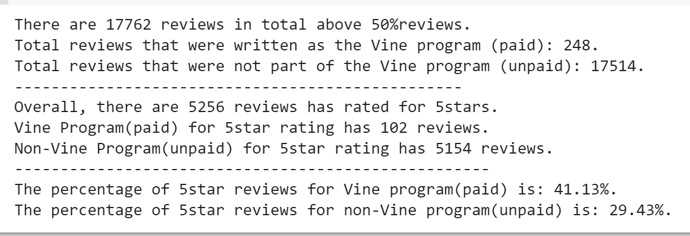
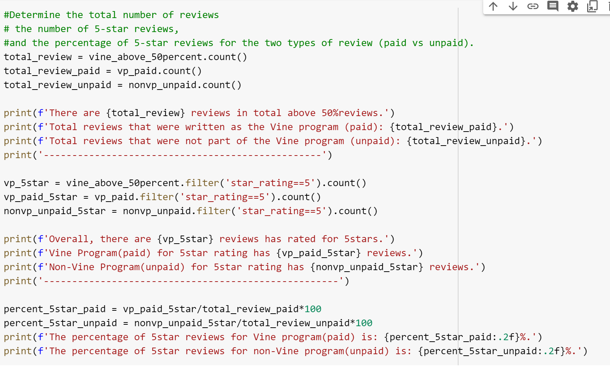

# Amazon Vine Analysis

## Overview of the analysis
Amazon Vine Analysis project analyzes Amazon reviews that are written by members of the paid/unpaid Amazon Vine program. We perform the ETL process by using PySpark, AWS RDS instance, and pgAdmin to analyze the reviews of special product: software. Our goal is to determine if there is any bias toward favorable reviews from Vine members in our dataset.

## Results
According to our analysis, there are total 17,762 reviews. 
- Vine Program(paid) Reviews:
  - Reviews were written as the Vine program(paid) has 249.
  - There are 102 Vine reviews were 5 stars.
  - 5 stars reviews has 41.13%.

- Non-Vine Program(unpaid) Reviews:
  - Reviews were not part of the Vine program(unpaid) has 17,514.
  - There are 5,154 non-Vine reviews were 5 stars.
  - 5 stars reviews has 29.43%.

Reference:

### Resources
Codes for determination of analysis:

Exhibit 1: 
- Software review table:
https://github.com/FIRE-Phoebe/Amazon_Vine_Analysis/blob/2f8f8fc27d09ade588386386f8bec4ba239e66b4/images/review_table.PNG

Exhibit 2: 
- Software product table:
https://github.com/FIRE-Phoebe/Amazon_Vine_Analysis/blob/2f8f8fc27d09ade588386386f8bec4ba239e66b4/images/products_table.PNG

Exhibit 3: 
- Software customers table:
https://github.com/FIRE-Phoebe/Amazon_Vine_Analysis/blob/2f8f8fc27d09ade588386386f8bec4ba239e66b4/images/customers_table.PNG

Exhibit 4: 
- Software vine table:
https://github.com/FIRE-Phoebe/Amazon_Vine_Analysis/blob/2f8f8fc27d09ade588386386f8bec4ba239e66b4/images/vine_table.PNG

## Summary
Based on the result, it indicates that there is a positivity bias for reviews in the Amazon Vine program. As we compare the percentage of 5 stars reviews, all Vine for the software reviews has 41.13% and non-Vine reviews has only 29.43%. If there's no bias for reviews, we will expect the percentage of 5 stars reviews for both Vine(paid) and non-Vine program(unpaid) are roughly the same. 

In this case, further studies for bias reviews examination could use statistical distribution analysis that apply to the dataset. Though calculate the mean, standard deviation and mode, significate level, statistical differnece and look at the distribution tendency to determine any bias towards Amazon Vine reviews.
